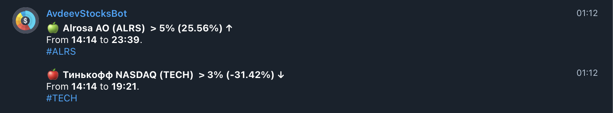

## Short Introduced
[AvdeevStocksBot](https://t.me/AvdeevStocks_bot) - телеграм бот, который позволяет в режиме реального времени мониторить котировки ценных бумаг и отправлять сообщения в телеграме при необходимости.

## Current Features
1. Команда `stocks:save_share_prices` отправляет запрос в [MOEX API](https://www.moex.com/a2193), получает информацию о заданных ценных бумагах, преобразовывает ее и записывает в хранилище (.json файл), название которого совпадает с текущим днем `src/../stocks_prices_by_date_data/22_06_2021.json`.

2. Команда `stocks:check_difference_in_share_prices` считывает содержимое файла, записанного на предыдущем этапе, и сравнивает изменение цен по некоторому алгоритму и в случае значимого изменения отправляет сообщение в телеграме с изменениями.

3. Команда `stocks:check_one_day_diff_once` TODO.

## Launch CRON
Запуск крона происходит командой
`forever start src/cron_scripts/start.js`